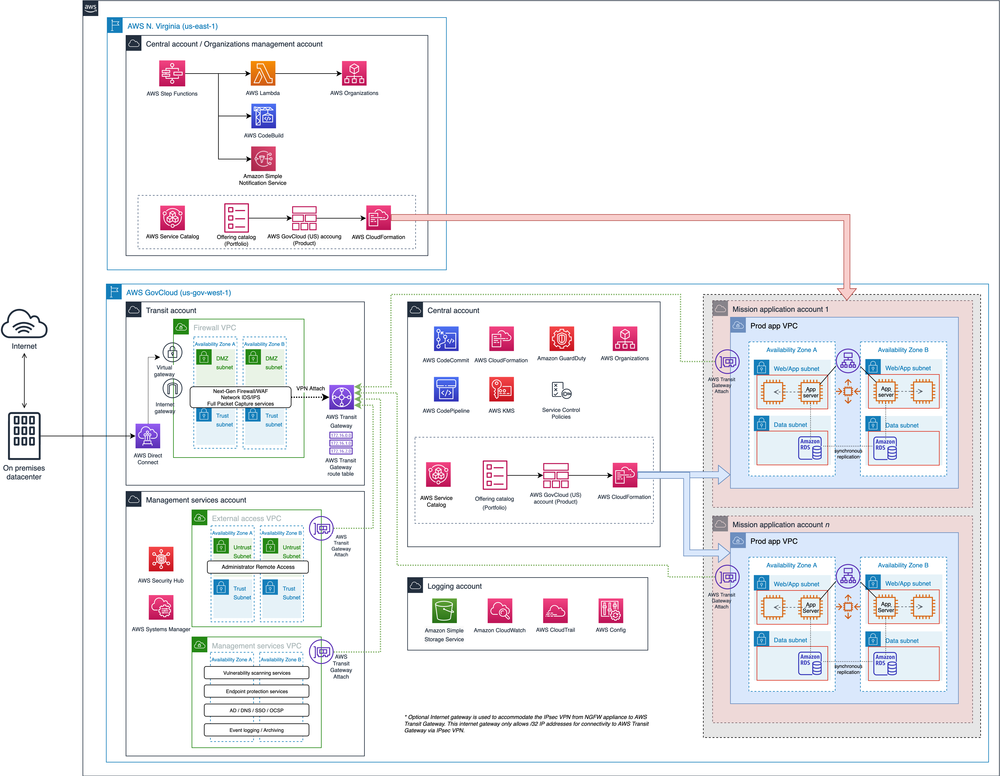

# Compliant Framework for Federal and DoD Workloads in AWS GovCloud (US)

## Overview

The [Compliant Framework for Federal and DoD Workloads in AWS GovCloud (US)](https://aws.amazon.com/solutions/implementations/compliant-framework-for-federal-and-dod-workloads-in-aws-govcloud-us/)
solution enables you to quickly deploy a secure, scalable, multi-account
environment in AWS GovCloud (US) based on AWS best practices. This solution is
architected to follow the Defense Information Systems Agency (DISA) Cloud
Computing (CC) Security Requirements Guide (SRG) for hosting Impact Level (IL) 4
and 5 workloads in the cloud. Using this solution, you can quickly deploy an
architecture baseline that accommodates U.S. federal and Department of Defense
(DoD) requirements to rapidly achieve Authority to Operate (ATO).

In addition to U.S. federal and DoD customers, this solution is also architected
to support defense industrial base customers to achieve Cybersecurity Maturity
Model Certification (CMMC) readiness.

For an overview and solution deployment guide, please visit [Compliant Framework for Federal and DoD Workloads in AWS GovCloud (US)](https://aws.amazon.com/solutions/implementations/compliant-framework-for-federal-and-dod-workloads-in-aws-govcloud-us/)

---
IMPORTANT: This solution will not, by itself, make you DoD CC SRG or CMMC
compliant. It provides the foundational infrastructure from which additional
complementary solutions can be integrated. The information contained in this
solution implementation guide is not exhaustive. You must review, evaluate,
assess, and approve the solution in compliance with your organization’s
particular security features, tools, and configurations. It is the sole
responsibility of you and your organization to determine which regulatory
requirements are applicable and to ensure that you comply with all requirements.
Most of the requirements under the DoD CC SRG or CMMC are administrative and not
technical (that is, people- and process-oriented). Although this solution
discusses both the technical and administrative requirements, this solution does
not help you comply with the non-technical administrative requirements.

---

## On this Page
-   [Architecture Overview](#architecture-overview)
-   [Deployment](#deployment)
-   [Source Code](#source-code)
-   [Creating a Custom Build](#creating-a-custom-build)

## Architecture Overview

The solution’s AWS CloudFormation template deploys an environment suitable
for migrating, building, and/or deploying applications and capabilities into
AWS. This can include workloads such as web-based application servers, database
servers, or products and services running on Amazon EC2. These workloads are
hosted in Mission App Accounts, which are logically separated enclaves that
allow for data and access segregation between different Mission Owners or
Organizations.

<p align="center">
  
  <br/>
</p>


## Deployment
The solution is deployed using a CloudFormation template. For details on
deploying the solution please see the details on the solution home page:
[Compliant Framework for Federal and DoD Workloads in AWS GovCloud (US)](https://aws.amazon.com/solutions/implementations/compliant-framework-for-federal-and-dod-workloads-in-aws-govcloud-us/)


## Source Code

### Project directory structure

```
├── deployment                          [folder containing build scripts]
│   ├── cdk-solution-helper             [a helper function to help deploy lambda function code through S3 buckets]
│   ├── framework-nuke                  [helper python scripts to help uninstall the solution]
└── source                              [source code containing CDK App and lambda functions]
    ├── bin                             [entrypoint of the CDK application]
    ├── lambda                          [folder containing source code the lambda functions]
    ├── images                          [folder containing images describing this solution]
    ├── lib
    │   ├── account-vending-machine     [CDK constructs for Account Vending Machine]
    ├── repositories                    [folder containing the source code to populate CodeCommit in GovCloud]
```

## Creating a Custom Build

The solution can be deployed through the CloudFormation template available on
the solution home page: [Compliant Framework for Federal and DoD Workloads in
AWS GovCloud (US)](https://aws.amazon.com/solutions/implementations/compliant-framework-for-federal-and-dod-workloads-in-aws-govcloud-us/).
To make changes to the solution, using the below steps download or clone this
repo, update the source code and then run the deployment/build-s3-dist.sh script
to deploy the updated code to an Amazon S3 bucket in your account.

### 1. Clone the repository

Clone this git repository

`git clone https://github.com/awslabs/compliant-framework-for-federal-and-dod-workloads-in-aws-govcloud-us.git`

### 2. Build the solution for deployment

-   To run the unit tests

```
cd <rootDir>/source
chmod +x ./run-all-tests.sh
./run-all-tests.sh
```

-   Configure the bucket name of your target Amazon S3 distribution bucket

```
export DIST_OUTPUT_BUCKET=my-bucket-name
export VERSION=my-version
```

-   Now build the distributable:

```
cd <rootDir>/deployment
chmod +x ./build-s3-dist.sh
./build-s3-dist.sh $DIST_OUTPUT_BUCKET $SOLUTION_NAME $VERSION

```

-   Parameter details

```
$DIST_OUTPUT_BUCKET - This is the global name of the distribution. For the bucket name, the AWS Region is added to the global name (example: 'my-bucket-name-us-west-2') to create a regional bucket. The lambda artifact should be uploaded to the regional buckets for the CloudFormation template to pick it up for deployment.
$SOLUTION_NAME - The name of This solution (example: compliant-framework-for-federal-and-dod-workloads-in-aws-govcloud-us)
$VERSION - The version number of the change
```

-   Deploy the distributable to an Amazon S3 bucket in your account. _Note:_ you must have the AWS Command Line Interface installed.

```
aws s3 cp ./global-s3-assets/ s3://my-bucket-name-<aws_region>/compliant-framework-for-federal-and-dod-workloads-in-aws-govcloud-us/<my-version>/ --recursive --acl bucket-owner-full-control --profile aws-cred-profile-name
aws s3 cp ./regional-s3-assets/ s3://my-bucket-name-<aws_region>/compliant-framework-for-federal-and-dod-workloads-in-aws-govcloud-us/<my-version>/ --recursive --acl bucket-owner-full-control --profile aws-cred-profile-name
```

***

Copyright 2020 Amazon.com, Inc. or its affiliates. All Rights Reserved.

Licensed under the Apache License Version 2.0 (the "License"). You may not use
this file except in compliance with the License. A copy of the License is
located at

    http://www.apache.org/licenses/

or in the "license" file accompanying this file. This file is distributed on an
"AS IS" BASIS, WITHOUT WARRANTIES OR CONDITIONS OF ANY KIND, express or implied.
See the License for the specific language governing permissions and limitations
under the License.
